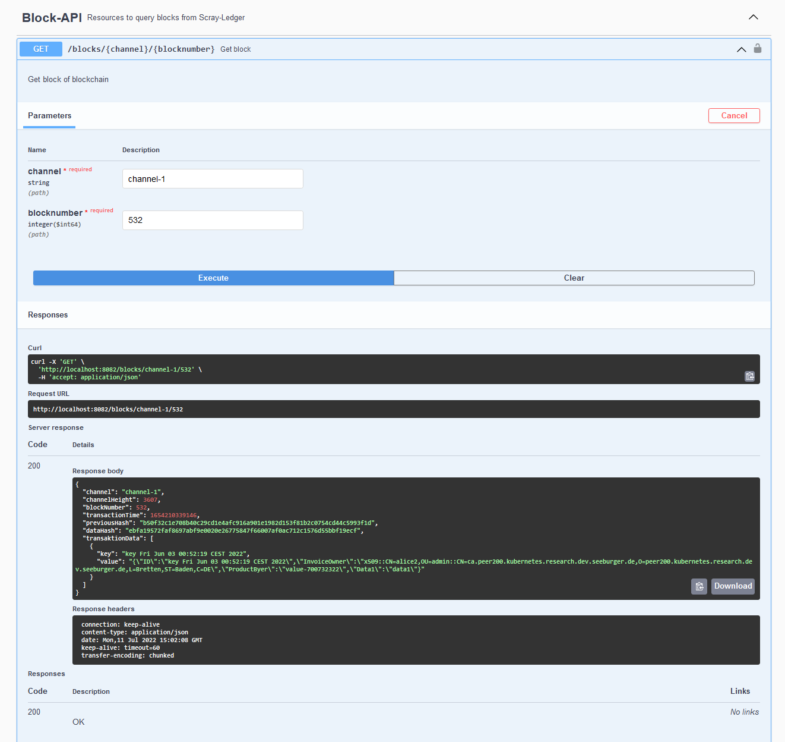

# REST-API query blocks from channel


## Run Server
  ``java -jar -Dserver.port=8082 audit-rest-api-0.0.1-SNAPSHOT.jar  --wallet ~/wallet/``

## Deploy API in K8s cluster
```
LOCAL_WALLET_PATH=/home/ubuntu/event-api/hlf-event-client/wallet
WALLET_ID=alice.id
```

## Provide configuration and wallet
```
kubectl create secret generic audit-rest-api-i1 --from-file=connection.yaml=$LOCAL_WALLET_PATH/connection.yaml --from-file=$WALLET_ID=$LOCAL_WALLET_PATH/$WALLET_ID
```

## Start
```
kubectl apply -f k8s-event-rest-api.yaml
```

### Query API port
```
EVENT-API-PORT=$(kubectl get service scray-ledger-event-api -o jsonpath="{.spec.ports[?(@.name=='api-port')].nodePort}")
```

### Swagger UI

```
$EVENT-API-PORT/swagger-ui/index.html
```


## Swagger definition
  [Swagger UI](http://localhost:8082/swagger-ui/index.html)


## Example query




