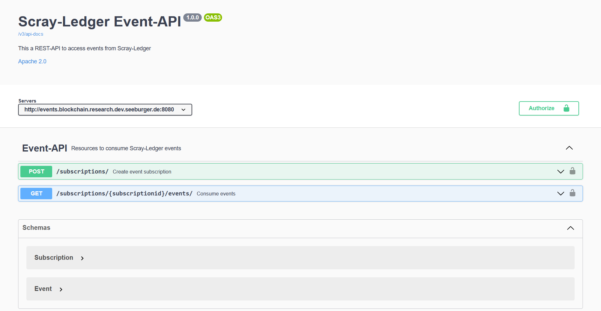

## Event Management

### Scray-Ledger Event-API

REST-API to consume chaincode events. 



More technical information can be found [here](event-rest-api)

## Deploy API in K8s cluster
```
LOCAL_WALLET_PATH=/home/ubuntu/event-api/hlf-event-client/wallet
WALLET_ID=alice.id
```

### Provide configuration and wallet
```
kubectl create secret generic event-rest-api-i1 --from-file=connection.yaml=$LOCAL_WALLET_PATH/connection.yaml --from-file=$WALLET_ID=$LOCAL_WALLET_PATH/$WALLET_ID
```

### Start deployment
```
kubectl apply -f k8s-event-rest-api.yaml
```

### Query API port
```
EVENT_API_PORT=$(kubectl get service scray-ledger-event-api -o jsonpath="{.spec.ports[?(@.name=='api-port')].nodePort}")
```

### Swagger UI

```
$EVENT_API_PORT/swagger-ui/index.html
```

